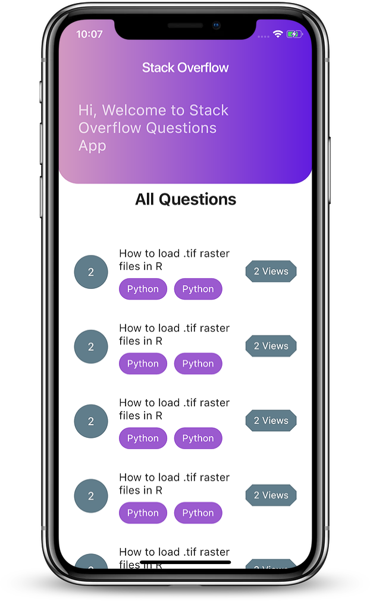

# Flutter StackOverflow App

Flutter StackOverflow App using the stack overflow questions api which we made using django.

### Show some :heart: and star the repo to support the project

## Watch Video Tutorials

1.  [Flutter Stack Overflow App Video Tutorials](https://youtu.be/-MBWdZ1u8tQ)

### Screenshots

### Created & Maintained By

[Pawan Kumar](https://github.com/iampawan) ([@imthepk](https://www.twitter.com/imthepk)) ([Youtube](https://www.youtube.com/c/MTechViral))
([Insta](https://www.instagram.com/codepur_ka_superhero))

# License

    Copyright 2019 Pawan Kumar

    Licensed under the Apache License, Version 2.0 (the "License");
    you may not use this file except in compliance with the License.
    You may obtain a copy of the License at

       http://www.apache.org/licenses/LICENSE-2.0

    Unless required by applicable law or agreed to in writing, software
    distributed under the License is distributed on an "AS IS" BASIS,
    WITHOUT WARRANTIES OR CONDITIONS OF ANY KIND, either express or implied.
    See the License for the specific language governing permissions and
    limitations under the License.

## Getting Started

For help getting started with Flutter, view our online
[documentation](https://flutter.dev/).
